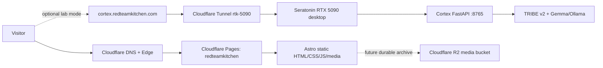
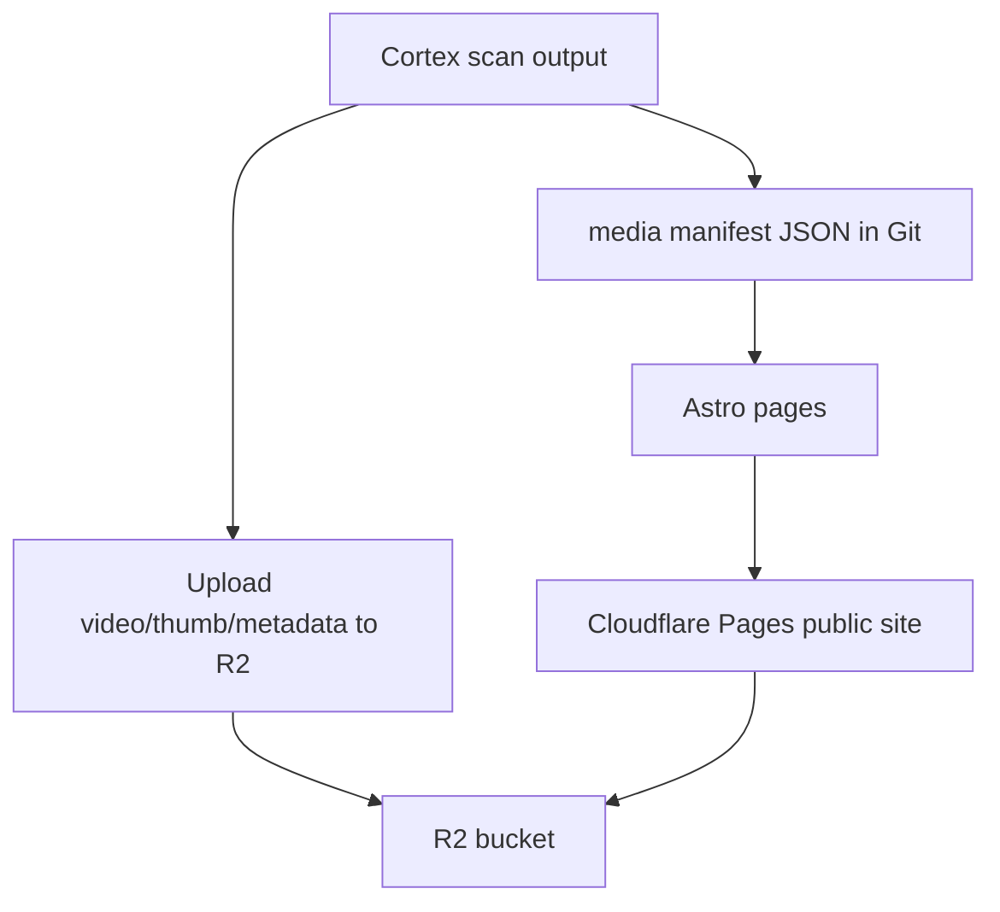

# Red Team Kitchen Web Architecture

Updated: 2026-06-23

## Executive Summary

Red Team Kitchen is hosted as a static Astro site on Cloudflare Pages. The
public site is designed to remain useful even when the local RTX 5090 desktop is
offline. Dynamic Cortex compute stays behind a Cloudflare Tunnel as optional lab
mode; durable public artifacts are served from Cloudflare Pages today and should
move to Cloudflare R2 as the archive grows.

## Public Surfaces

| Surface | Current host | Purpose | Resilience |
|---|---|---|---|
| `redteamkitchen.com` | Cloudflare Pages project `redteamkitchen` | Canonical public site | Always-on edge static site |
| `www.redteamkitchen.com` | Same Pages project | WWW alias | Always-on edge static site |
| `redteamkitchen.pages.dev` | Same Pages project | Cloudflare project URL | Always-on edge static site |
| `redteamkitchen-v2.pages.dev` | Cloudflare Pages project `redteamkitchen-v2` | Staging / preview | Always-on edge static site |
| `redteamkitchen-gemma.pages.dev` | Cloudflare Pages project `redteamkitchen-gemma` | Gemma archive deploy target | Always-on edge static site |
| `cortex.redteamkitchen.com` | Cloudflare Tunnel to Seratonin `localhost:8765` | Optional live Cortex lab | Only works when PC + app + tunnel are healthy |
| `mercury.redteamkitchen.com` | Cloudflare Tunnel to Seratonin `localhost:9119` | Local Mercury dashboard | Should be protected or retired publicly |
| `inference.redteamkitchen.com` / `ollama.redteamkitchen.com` | Cloudflare Tunnel to Seratonin `localhost:11434` | Local model API | Should not be public unless intentionally exposed |

## Source Repositories

| Repo | Path | Remote | Role |
|---|---|---|---|
| `redteamkitchen` | `D:\rtk-web` | `https://github.com/AlexiosBluffMara/redteamkitchen` | Public web source, Cloudflare Pages build output |
| `cortex` | `D:\cortex` | `https://github.com/AlexiosBluffMara/cortex` | FastAPI + Three.js brain viewer + TRIBE/Gemma pipeline |
| `mercury` | `D:\mercury` | `https://github.com/AlexiosBluffMara/mercury` | Gemma 4 Good / Hermes fork archive |

## Request Flow



## Build And Deploy

Local build:

```powershell
cd D:\rtk-web
npm ci
npm run build
```

Direct deploys through Wrangler:

```powershell
npx wrangler pages deploy ./dist --project-name redteamkitchen-v2 --branch main --commit-dirty=true
npx wrangler pages deploy ./dist --project-name redteamkitchen-gemma --branch main --commit-dirty=true
npx wrangler pages deploy ./dist --project-name redteamkitchen --branch main --commit-dirty=true
```

GitHub Actions:

- `CI`: runs on pushes and pull requests.
- `Deploy -> staging`: runs on `main` pushes, deploys to `redteamkitchen-v2`.
- `Deploy -> gemma`: runs on `main` pushes, deploys to `redteamkitchen-gemma`.
- `Deploy -> production`: manual only; requires typing `PROMOTE`.

Required GitHub repository secrets:

- `CLOUDFLARE_API_TOKEN`
- `CLOUDFLARE_ACCOUNT_ID`

Cloudflare Pages is not Git-connected in the dashboard yet. Deploys are currently
Wrangler uploads from either local shell or GitHub Actions.

## Cortex Gallery Architecture

The public Cortex page does not depend on the live app. It uses a checked-in
screenshot preview at:

```text
public/media/cortex/cortex-gallery-brain-preview.png
```

The live Cortex gallery at `http://127.0.0.1:8765/gallery.html` renders the
actual cortical surface in-browser:

- Per-vertex mode uses `/api/scan/{id}/bold-vertex` when `D:\cortex\scans\{id}.npy` exists.
- Regional fallback mode uses `/api/scan/{id}/bold-simulate` for scans without persisted vertices.
- The gallery no longer uses the old ASCII-video MP4s as the primary preview.

This means the story shown on the website and the local lab match: Cortex is a
Three.js brain-surface viewer, not a matrix-video placeholder.

## Durable Media Plan

Current small media files are checked into the site repo so the deployed site is
self-contained. As the archive grows, move media to R2:



Recommended manifest shape:

```json
{
  "id": "scan-id",
  "title": "Human readable scan",
  "project": "cortex",
  "source_kind": "video|image|text|audio",
  "brain_preview_url": "https://media.redteamkitchen.com/cortex/scan-id/preview.mp4",
  "thumbnail_url": "https://media.redteamkitchen.com/cortex/scan-id/thumb.jpg",
  "scan_json_url": "https://media.redteamkitchen.com/cortex/scan-id/scan.json",
  "notes": "What this artifact proves and what it does not prove."
}
```

## Security Boundaries

Public and safe by default:

- `redteamkitchen.com`
- `www.redteamkitchen.com`
- Pages preview URLs

Needs care before public use:

- `cortex.redteamkitchen.com`: acceptable as clearly labeled lab mode, but only
  when the PC is meant to be reachable.
- `mercury.redteamkitchen.com`: should be protected with Cloudflare Access or
  removed from public DNS if it exposes dashboard state.
- `ollama.redteamkitchen.com` and `inference.redteamkitchen.com`: should be
  protected unless intentionally operated as public APIs.

Never depend on:

- Old Tailscale Funnel URLs in public copy.
- The local desktop as the only way for the website to be useful.
- Large binary demo files inside Git history.

## Current Known Gaps

1. Cloudflare Pages is still direct-upload / Wrangler-driven, not dashboard
   Git-connected.
2. `gemma.redteamkitchen.com` is not attached to `redteamkitchen-gemma` yet.
3. Durable Cortex media should move to R2 before the gallery grows.
4. Mercury local `main` contains an older unpushed 361 MB demo-video commit; do
   not push it without splitting or externalizing that artifact.
5. The Cloudflare Tunnel public subdomains should be reviewed and protected.
